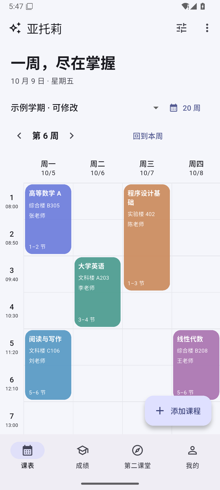
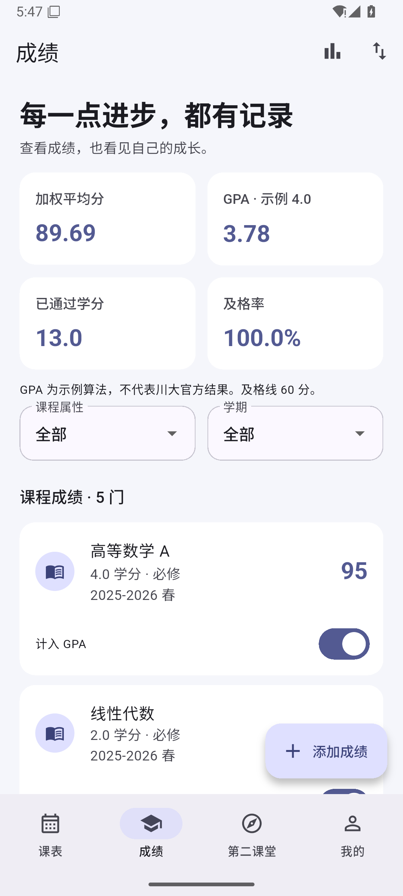

# 亚托莉校园助手

根据 [PROJECT_SPEC.md](PROJECT_SPEC.md) 独立实现的 Flutter Android MVP，默认游客模式。课表和成绩保存在本机；第二课堂和志愿四川使用明确标记的本地示例。

## 已实现功能

- 四栏导航：课表、成绩、第二课堂、我的；“我的”提供志愿四川、数据管理、外观设置、关于。
- 课表：周视图、教学周切换、单双周、课程详情和增删改、多课表、冲突提醒、学期与节次设置。
- 成绩：录入与编辑、学期和课程属性筛选、GPA 排除开关、加权平均、通过学分与及格率、学期分析及分布图。
- 活动：第二课堂分数、报名时间、志愿时长、完成次数、状态筛选、详情、加载/空/错误状态。
- 外观：浅色、深色、跟随系统、主题色、卡片圆角和透明度、教师/教室显示。
- 数据：课表和成绩 JSON/CSV 导入导出、课表 ICS 导出、完整 JSON 备份恢复、缓存清理和删除本地数据。
- 状态恢复：记住底部页面与所选课表；再次进入课表默认当前教学周。

GPA 使用可替换的示例 4.0 策略，页面明确说明不是川大官方算法。真实登录、教务同步、活动报名属于后续阶段。

## 界面预览

截图均为独立编写的示例数据。

| 课表 | 成绩 |
|---|---|
|  |  |

## APK 下载

可从 [v1.0.0 Release](https://github.com/qyssz/atori/releases/tag/v1.0.0) 下载
[Android APK](https://github.com/qyssz/atori/releases/download/v1.0.0/app-release.apk)。
本地构建产物位于 `build/app/outputs/flutter-apk/app-release.apk`。最低Android7.0，当前为开发签名。
个人课表导入文件、设备备份、SDK缓存和签名密钥均不进入仓库。

## 环境要求

本次验证工具链：Flutter **3.47.7**、Dart **3.13.5**、Android SDK **36**、Build Tools **36.0.0**、NDK **28.2.13676358**、Gradle **9.3.1**、AGP **9.1.0**、Java **25.0.4.1**。依赖锁定于 `pubspec.lock`。

最低 Android 为 **7.0 / API 24**。需求建议 API 23，但所用 Flutter stable 模板的最低值是 API 24；工程沿用该要求。SDK 无需放进源码目录。

## 运行和构建

在标准已配置的 Flutter 环境中：

```powershell
flutter pub get
flutter run
flutter analyze
flutter test
flutter build apk --release
```

当前 Windows 工作目录包含中文，已复现分析服务的路径错误。辅助脚本将源码复制到英文构建目录，源码仍保留在原目录；仅对当前进程设置 SDK 和缓存环境变量：

```powershell
# 当前机器工具链位于 D:/atori-sdk；Java 位于 D:/编程/jdk
& ./scripts/run-flutter.ps1 -Action check
& ./scripts/run-flutter.ps1 -Action build-apk -Clean
```

APK 回复制至 `build/app/outputs/flutter-apk/app-release.apk`。详细安装、运行和问题处理见 [RUNBOOK](docs/RUNBOOK.md)。

当前包名 `com.example.atori`，Release 构建采用**开发签名**，用于本地安装验收。正式分发前需确认包名并配置发布密钥。

## 使用方式

第一次打开会载入示例学期、课程、成绩及活动，便于直接体验。示例学期按首次启动日期设置为第 6 周，并非学校真实校历。

1. 课表右上角设置学期第一周的周一及教学周数；“我的 → 外观设置”调整上课时间。
2. 点击“添加课程”录入课程，点击卡片查看详情、修改或删除。重叠时会提示，确认保留后并排显示。
3. 成绩页面添加真实成绩并按学期筛选；“是否计入 GPA”只影响 GPA。
4. “我的 → 数据管理”导入/导出或备份。课程导入追加至当前课表，完整恢复会经确认替换全部业务数据。
5. 删除全部本地数据后得到空课表，重启不会自动恢复示例。活动示例可以显式重新载入。

导入格式及可用样例见 [数据格式说明](docs/DATA_FORMAT.md) 和 `examples/`。

## 项目结构

```text
lib/
  main.dart                    初始化本地存储
  app/app.dart                 主题、路由、四栏导航
  core/storage/                Controller、Repository、Hive 与 Mock 数据源
  core/network/                尚未启用的 HTTPS / 安全 Token 请求基础
  core/utils/                  JSON、CSV、ICS
  features/timetable/          周课表与课程编辑
  features/grades/             成绩界面与独立计算策略
  features/second_class/       第二课堂及共用的志愿活动界面
  features/settings/           我的、外观与数据管理
  shared/models/               类型与数据校验
assets/mock/                   四份独立编写的示例
test/                          领域、数据交换、存储与界面回归
android/                       Android 工程
scripts/                       工具链准备、环境诊断与构建
docs/                          现状、清单、运行、格式与交付记录
```

数据流为 UI → Riverpod Controller → Repository → Local/Mock DataSource。设置与业务数据统一保存为一个 Hive 快照，便于完整备份和原子恢复；SharedPreferences 保存最后一个底部页面。真实网络请求未接入页面。

## 数据与隐私

这是独立校园助手，不是四川大学或志愿四川官方应用。未复制参考项目的代码、图标或素材，也未访问真实校园账号。

本版本不需要账号、密码、定位或全盘文件权限，不向校园服务器发送数据。导入导出使用系统文件选择器。普通数据库保存课表、成绩、活动示例和偏好；完整备份可能包含个人学习信息，请自行保管。凭据不进入普通数据库或备份；安全凭据存储仅为未来接口接入预留。

Android 自动备份关闭。清除缓存仅删除活动缓存；删除全部本地数据需确认，课程、成绩、活动和外观设置都会被删除。Android 卸载也会删除应用私有数据。

## 开发与验证记录

- [项目现状](docs/PROJECT_STATUS.md)
- [后续开发清单](docs/DEVELOPMENT_BACKLOG.md)
- [运行与验证说明](docs/RUNBOOK.md)
- [交付记录与验收](docs/DELIVERY_REPORT.md)
